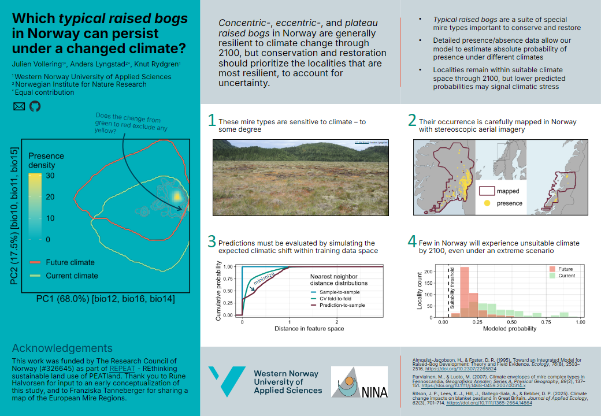

## The distribution of typical raised bogs in Norway under climate change

This repo contains the study's R code. Analyses are in progress and will be updated continuously.

The poster below, presented at the British Ecological Society Annual Meeting 2025, summarizes some of the background and preliminary results.

